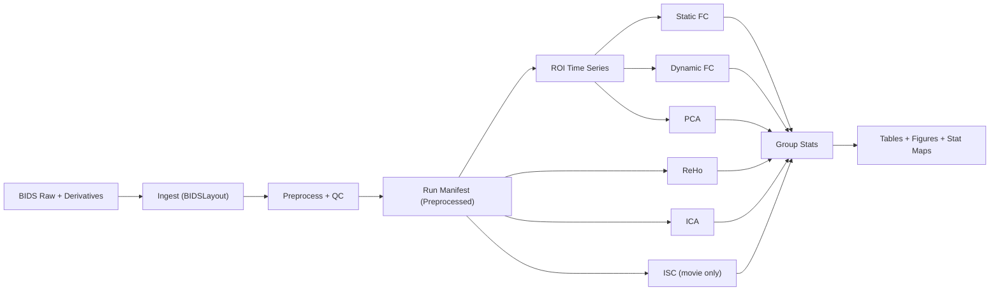

# Software Architecture

## 1) Architectural Style
The repository uses a modular pipeline architecture with explicit stage boundaries and persisted artifacts. Each stage can be run independently, but the default orchestration executes them in sequence.

Design goals:
- Reproducibility: configuration-driven behavior; deterministic seeding.
- Composability: each metric is a separate module with clear input/output contracts.
- Traceability: manifests and logs are persisted at each stage.

## 2) Layered Model
### Reliability Layer
Modules:
- `bids_ingest.py`
- `preprocessing.py`
- `qc.py`

Responsibilities:
- Resolve BIDS entities and derivative files
- Build confound matrices and scrub masks
- Produce cleaned fMRI time series (unsmoothed and smoothed)
- Generate exclusion flags and QC summaries

### Feature Module Layer
Modules:
- `roi.py`
- `reho.py`
- `connectivity.py`
- `ica.py`
- `pca_metrics.py`
- `isc.py`

Responsibilities:
- Derive per-run/per-subject representations
- Persist standardized metric artifacts for reuse

### Decision Layer
Modules:
- `stats.py`
- `viz.py`
- group orchestration in `pipeline.py`

Responsibilities:
- Build diagnosis/covariate design matrices
- Run mass-univariate inference
- Apply multiple-comparison correction
- Produce result tables and figures

## 3) Runtime Components
- CLI entrypoints:
  - `scripts/run_pipeline.py` (full run)
  - `scripts/run_step.py` (single milestone)
- Orchestrator:
  - `pipeline.py`
- Configuration loader:
  - `config.py`
- Shared utilities:
  - `utils.py`

## 4) Data Flow

## 5) Stage Contracts
### Ingest Contract
Input:
- BIDS roots and derivatives root from YAML

Output:
- `manifests/participants_merged.csv`
- `manifests/run_manifest_raw.csv`

### Preprocess/QC Contract
Input:
- Run manifest raw
- confounds TSV + mask + preproc BOLD

Output:
- cleaned images under `preprocessed/...`
- `qc/qc_summary.csv`
- `manifests/run_manifest_preprocessed.csv`

### Metric Contracts
- ROI: `roi_timeseries.npy/csv` per run
- ReHo: `reho_map.nii.gz` per run
- Static FC: Fisher-z matrix per run and subject-level means
- Dynamic FC: mean + variability matrices per run and subject-level means
- ICA: per-subject maps/timecourses + matched loadings table
- PCA: per-subject top-5 EVR table
- ISC: mean/p/q/sig NIfTI maps (if movie cohort available)

### Group Stats Contract
Input:
- metric artifacts + participant covariates + QC-derived mean FD

Output:
- edge-level and network-level CSV tables
- voxelwise diagnosis effect maps
- summary figures

## 6) Configuration and Control Plane
Single source of runtime truth: `config/pipeline.yaml`

Key controls:
- dataset paths
- task names
- preprocessing thresholds
- model covariates and diagnosis labels
- computational settings (`n_jobs`, debug mode)

## 7) Error Handling and Observability
- Logging: timestamped file logs under `derivatives/logs`
- Persisted manifests: enable resume/re-analysis without re-ingestion
- QC flags: explicit exclusion reasons by run
- Warnings:
  - TR heterogeneity
  - missing diagnosis/covariates
  - insufficient movie subjects for ISC

## 8) Reproducibility Controls
- deterministic random seed in config
- pinned dependencies via `requirements.txt` and `environment.yml`
- deterministic output paths and naming conventions

## 9) Extension Points
Common safe extension points:
- Add a new metric module under `src/fmri_pipeline/` and register it in `pipeline.py`
- Add additional covariates in config and allow through design matrix logic
- Add alternative multiple-testing correction methods in `stats.py`

## 10) Known Architectural Constraints
- Current local run assumes fMRIPrep derivatives already exist
- ISC requires a separate movie cohort with enough controls
- ReHo runtime is compute-heavy for large cohorts; chunking and parallelism are implemented but can still be slow
