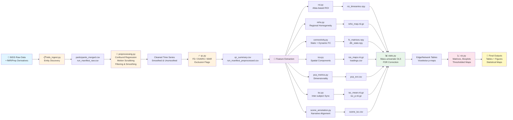

# Software Architecture: fMRI-Pipeline

## 1. Overview and Design Philosophy

The fMRI-Pipeline is a modular, configuration-driven neuroimaging analysis framework designed to process task-based and resting-state functional magnetic resonance imaging (fMRI) data from BIDS-compliant repositories. The software implements a three-tier architecture that enforces separation of concerns, enables reproducible analysis, and facilitates both routine clinical pipelines and novel methodological development.

### Core Design Principles

**Configuration-Driven Execution:** All runtime parameters—including data sources, preprocessing thresholds, statistical models, and computational allocation—are specified through a single YAML configuration file, eliminating hard-coded assumptions and enabling rapid experimentation across datasets and cohorts.

**Modular Composability:** Each processing stage (ingest, preprocess, metric computation, inference) is a self-contained module with explicit input/output contracts. Modules may be executed independently or orchestrated in sequence, supporting both exploratory analysis and production pipelines.

**Reproducibility by Default:** The framework enforces deterministic behavior through pinned dependencies, explicit random seeds, manifest-based provenance tracking, and standardized naming conventions. All intermediate artifacts are persisted, enabling transparent re-analysis and audit trails.

**Traceability and Observability:** Run-time decisions, exclusion criteria, and quality-control flags are logged persistently, and intermediary artifacts (e.g., confound matrices, scrub masks, registration failures) are retained for inspection. This design facilitates both methodological transparency and post-hoc quality assurance.

---

## 2. Architectural Overview: Three-Tier Design

The pipeline organizes 15 modules across three architectural tiers, each responsible for distinct stages of the data processing workflow:

```
┌─────────────────────────────────────────────────────────────────┐
│                    TIER 3: DECISION LAYER                        │
│   stats.py (group inference)  |  viz.py (visualization)          │
│         Output: p-maps, tables, figures                          │
└──────────────────────┬──────────────────────────────────────────┘
                       │
┌──────────────────────┴──────────────────────────────────────────┐
│              TIER 2: FEATURE EXTRACTION MODULES                 │
│  roi.py  │  reho.py  │  connectivity.py  │  ica.py  │  pca.py  │
│                             isc.py  │  scene_annotation.py       │
│   Output: Standardized metric artifacts (maps, matrices, tables) │
└──────────────────────┬──────────────────────────────────────────┘
                       │
┌──────────────────────┴──────────────────────────────────────────┐
│            TIER 1: RELIABILITY LAYER                            │
│   bids_ingest.py  →  preprocessing.py  →  qc.py                │
│      Output: Cleaned fMRI time series + quality flags           │
└─────────────────────────────────────────────────────────────────┘
```

### Tier 1: Reliability Layer

**Responsibility:** Data ingestion, preprocessing, and quality control. Ensures that downstream analysis operates on validated, cleaned time series.

**Modules:**

- **`bids_ingest.py` (213 lines):** BIDS entity discovery and run manifest generation
  - Discovers BIDS-compliant fMRI datasets using PyBIDS BIDSLayout
  - Extracts participant demographics and clinical covariates from `participants.tsv`
  - Identifies preprocessed BOLD images and confound matrices from fMRIPrep derivatives
  - Generates two manifest files: `participants_merged.csv` (participant-level metadata) and `run_manifest_raw.csv` (run-level file pointers)
  - Validates that all required derivative files exist before downstream processing

- **`preprocessing.py` (197 lines):** Confound regression and noise reduction
  - Implements Friston-24 confound regression (24 motion parameters + derivatives)
  - White matter (WM) and cerebrospinal fluid (CSF) nuisance regression using tissue-based masks
  - Global signal regression (GSR) with optional control for signal loss
  - Framewise displacement (FD)-based scrubbing with configurable threshold (default: 0.5 mm)
  - Bandpass filtering (default: 0.01–0.1 Hz) with Butterworth IIR design
  - Spatial smoothing with Gaussian kernel (default: 6 mm FWHM)
  - Outputs both unsmoothed and smoothed derivatives for downstream flexibility

- **`qc.py` (112 lines):** Aggregate quality-control metrics
  - Computes per-run framewise displacement (FD) traces and cumulative scrub masks
  - Calculates DVARS (whole-brain temporal differencing) and temporal signal-to-noise ratio (tSNR)
  - Generates per-run QC summary CSV with summary statistics
  - Provides explicit exclusion flags (e.g., excessive motion, registration failure, missing confounds)
  - Enables downstream filtering of problematic runs during group-level analysis

---

### Tier 2: Feature Extraction Modules

**Responsibility:** Compute subject- and run-level representations (maps, connectivity matrices, components) that summarize neural dynamics and are suitable for group-level inference.

**Modules:**

- **`roi.py` (48 lines):** Regional time-series extraction via atlas-based parcellation
  - Loads Schaefer atlas (100, 200, or 400 parcels) in standard space
  - Uses NiftiLabelsMasker to extract mean time series for each parcel
  - Applies z-score standardization within run
  - Outputs per-run parcel time-series matrices (parcels × time)

- **`reho.py` (87 lines):** Voxelwise regional homogeneity (ReHo)
  - Computes Kendall's W concordance statistic over 26-voxel (3×3×3) neighborhoods
  - Implements chunked parallel computation to manage memory footprint for high-resolution images
  - Outputs per-run ReHo maps in native and standard space
  - Captures local synchronization patterns independent of global brain networks

- **`connectivity.py` (76 lines):** Static and dynamic functional connectivity
  - **Static FC:** Pearson correlation matrices (full run), followed by Fisher-z transformation for Gaussian behavior and combined analysis
  - **Dynamic FC:** Sliding-window correlation matrices (window size 22 TR, step 1 TR), with temporal variability (STD across windows)
  - Optional k-means clustering of windowed states for identifying recurrent connectivity patterns
  - Outputs per-run static matrices, dynamic state matrices, and subject-level summary statistics

- **`ica.py` (103 lines):** Independent component analysis (spatial ICA)
  - Applies FastICA decomposition (20 components) to subject-level 4D time series
  - Cross-subject component matching via max-correlation heuristic to enable aggregation
  - Computes network-level component loadings for group analysis
  - Outputs per-subject component maps and loading tables; enables data-driven identification of subject-specific networks

- **`pca_metrics.py` (43 lines):** Principal component analysis (PCA) for dimensional reduction
  - Applies PCA to concatenated ROI time series across runs
  - Computes explained variance ratios (EVR) for principal components (default: top 5)
  - Outputs per-subject EVR table; serves as a dimensionality metric for intrinsic data complexity

- **`isc.py` (120 lines):** Inter-subject correlation (ISC) for synchrony quantification
  - Implements leave-one-out ISC: correlation between each subject's time series and group average
  - Establishes significance via circular time-shift permutation null (500 permutations, FDR correction at α=0.05)
  - Outputs subject-level and group-level NIfTI maps with correlation, p-value, and q-value volumes
  - Specialized for movie-watching paradigms; identifies voxels with synchronous activation across subjects

- **`scene_annotation.py` (570 lines):** Scene boundary analysis and narrative alignment
  - Loads manually annotated scene boundaries (e.g., film cuts, narrative transitions)
  - Aligns scene indices to fMRI time via TR calibration
  - Integrates ISC maps with scene annotations to identify brain regions synchronized during specific narrative moments
  - Supports multi-level feature analysis (scene-level, transition-level)
  - Enables investigation of stimulus-driven neural synchrony and narrative comprehension

---

### Tier 3: Decision Layer

**Responsibility:** Statistical inference, group-level comparisons, and visualization. Translates metric artifacts into publishable results.

**Modules:**

- **`stats.py` (139 lines):** Mass-univariate group statistics
  - Constructs design matrices incorporating diagnosis, covariates (age, sex, site), and quality controls (mean FD, run length)
  - Implements ordinary least-squares (OLS) regression for voxelwise and network-level outcomes
  - Applies false discovery rate (FDR) correction at p<0.05 for multiple comparisons
  - Generates three output tables:
    - **Edge-level:** per-connection statistics (connectivity metrics)
    - **Network-level:** aggregate statistics per Schaefer network
    - **Voxelwise:** statistical maps in standard space
  - Implements robust regression options for heteroscedastic errors

- **`viz.py` (72 lines):** Publication-quality visualization
  - Renders connectivity matrices (static and dynamic) with hierarchical ordering by network
  - Generates thresholded difference matrices (group 1 vs. group 2)
  - Produces boxplots by diagnosis and covariates for exploratory data visualization
  - Outputs voxel maps in standard space (MNI-152) with publication-grade colormaps
  - Supports multiple output formats (PNG, PDF, NIfTI)

---

## 3. Data Flow and Dependencies

The following Mermaid diagram illustrates the complete data flow from raw BIDS data through group-level inference:


```mermaid
graph LR
    A["🔹 BIDS Raw Data<br/>+ fMRIPrep Derivatives"]
    
    A --> B["📋 bids_ingest.py<br/>Entity Discovery"]
    B --> B1["participants_merged.csv<br/>run_manifest_raw.csv"]
    
    B1 --> C["🧹 preprocessing.py<br/>Confound Regression<br/>Motion Scrubbing<br/>Filtering & Smoothing"]
    C --> C1["Cleaned Time Series<br/>Smoothed & Unsmoothed"]
    
    C1 --> D["✓ qc.py<br/>FD / DVARS / tSNR<br/>Exclusion Flags"]
    D --> D1["qc_summary.csv<br/>run_manifest_preprocessed.csv"]
    
    D1 --> E["🎯 Feature Extraction"]
    
    E --> E1["roi.py<br/>Atlas-based ROI"]
    E --> E2["reho.py<br/>Regional Homogeneity"]
    E --> E3["connectivity.py<br/>Static + Dynamic FC"]
    E --> E4["ica.py<br/>Spatial Components"]
    E --> E5["pca_metrics.py<br/>Dimensionality"]
    E --> E6["isc.py<br/>Inter-subject Sync"]
    E --> E7["scene_annotation.py<br/>Narrative Alignment"]
    
    E1 --> F1["roi_timeseries.npy"]
    E2 --> F2["reho_map.nii.gz"]
    E3 --> F3["fc_matrices.npy<br/>dfc_state.npy"]
    E4 --> F4["ica_maps.nii.gz<br/>loadings.csv"]
    E5 --> F5["pca_evr.csv"]
    E6 --> F6["isc_mean.nii.gz<br/>isc_p.nii.gz"]
    E7 --> F7["scene_isc.csv"]
    
    F1 & F2 & F3 & F4 & F5 & F6 & F7 --> G["📊 stats.py<br/>Mass-univariate OLS<br/>FDR Correction"]
    
    G --> G1["Edge/Network Tables<br/>Voxelwise p-maps"]
    
    G1 --> H["📈 viz.py<br/>Matrices, Boxplots<br/>Thresholded Maps"]
    
    H --> I["📑 Final Outputs<br/>Tables + Figures<br/>Statistical Maps"]
    
    style A fill:#e1f5ff
    style B fill:#fff3e0
    style C fill:#fff3e0
    style D fill:#fff3e0
    style E fill:#f3e5f5
    style G fill:#e8f5e9
    style H fill:#fce4ec
    style I fill:#fff9c4
```

**Key Characteristics:**

- **Sequential Dependency:** Tier 1 outputs feed Tier 2 modules; all Tier 2 outputs converge at Tier 3
- **Modularity:** Each feature module operates independently on preprocessed time series; no inter-module dependencies
- **Artifact Persistence:** All intermediate outputs (manifests, cleaned images, metric maps) are retained on disk for inspection, resumption, and re-analysis
- **Manifest-Based Provenance:** YAML manifests track which participants, runs, and derivative files were included at each stage, enabling transparent and auditable analyses

---

## 4. Module Input/Output Contracts

### Stage 1: BIDS Ingestion

**Input:**
- BIDS root directory (raw fMRI data)
- fMRIPrep derivatives directory (preprocessed BOLD, confounds, masks)
- Configuration YAML (dataset paths, task names)

**Output:**
- `manifests/participants_merged.csv`: Participant-level covariates (ID, diagnosis, age, sex, site, custom fields)
- `manifests/run_manifest_raw.csv`: Run-level file pointers (participant ID, session, run, path to BOLD, confounds, mask)

**Validation:**
- Verifies BIDS entity consistency (no missing TRs, homogeneous sampling)
- Flags missing fMRIPrep outputs or confound matrices
- Ensures participant covariates align with discovered runs

---

### Stage 2: Preprocessing and Quality Control

**Input:**
- `run_manifest_raw.csv`
- Per-run confound matrices (TSV), tissue masks (NIfTI), preprocessed BOLD images (NIfTI)

**Output:**
- `preprocessed/{participant_id}/ses-{session}/func/{run_id}_space-MNI152_bold_cleaned.nii.gz` (unsmoothed)
- `preprocessed/{participant_id}/ses-{session}/func/{run_id}_space-MNI152_bold_cleaned_smooth.nii.gz` (6 mm FWHM)
- `qc/qc_summary.csv`: Per-run QC metrics (FD mean/max, DVARS, tSNR, scrub rate, exclusion flags)
- `manifests/run_manifest_preprocessed.csv`: Updated manifest reflecting preprocessing completion and QC status

**Processing Steps:**
1. Confound regression: motion (24 parameters) + tissue masks (WM, CSF mean) + global signal (optional)
2. Scrubbing: FD > threshold → volume excision
3. Bandpass filtering: 0.01–0.1 Hz (Butterworth, 4th order)
4. Spatial smoothing: Gaussian kernel, 6 mm FWHM (optional, second output)

---

### Stage 3: Feature Extraction (Tier 2 Modules)

All Tier 2 modules consume cleaned time series from Stage 2 and produce standardized artifact types:

| **Module** | **Input** | **Output** | **Dimensionality** | **Format** |
|---|---|---|---|---|
| `roi.py` | Cleaned BOLD (native) | ROI time series | (Runs, Time, Parcels) | `.npy` / `.csv` |
| `reho.py` | Cleaned BOLD (native) | ReHo maps (native space) | (X, Y, Z) | `.nii.gz` |
| `connectivity.py` | ROI time series | Static FC (Pearson + Fisher-z) | (Parcels, Parcels) | `.npy` |
| `connectivity.py` | ROI time series | Dynamic FC (sliding window) | (Windows, Parcels, Parcels) | `.npy` |
| `ica.py` | Subject-level 4D BOLD | Component maps + loadings | 20 ICs × (X, Y, Z) | `.nii.gz` + `.csv` |
| `pca_metrics.py` | ROI time series | Explained variance ratios | (Top-5 components) | `.csv` |
| `isc.py` | Cleaned BOLD (movie cohort) | ISC maps (r, p, q) | (X, Y, Z, 3 volumes) | `.nii.gz` |
| `scene_annotation.py` | ISC maps + scene boundaries | Scene-ISC correlations | (Scenes, regions, metrics) | `.csv` |

**Standardization:**
- All outputs in standard MNI-152 space (except native-space intermediate formats)
- Consistent naming conventions: `{participant_id}_{metric}_{stage}.{ext}`
- Z-score standardization applied where appropriate (ROI time series, ICA loadings)

---

### Stage 4: Group-Level Inference

**Input:**
- Tier 2 metric artifacts (see above)
- `participants_merged.csv` with diagnosis and covariates
- QC summary (mean FD per run)

**Output:**
- `results/edge_stats.csv`: Per-connection effect sizes (β, SE, t, p, q), grouped by network
- `results/network_stats.csv`: Aggregate network-level statistics
- `results/voxelwise_pmap.nii.gz`: Voxelwise statistical p-value maps (FDR-corrected)
- `results/voxelwise_effect.nii.gz`: Effect size (β or correlation coefficient) maps
- Summary figures: connectivity matrices, boxplots, difference maps

**Statistical Framework:**
- Design matrix: `outcome ~ diagnosis + age + sex + site + mean_FD + (run_length)`
- Inference: OLS regression per metric (voxelwise, network, or edge)
- Multiple comparison correction: FDR at α=0.05

---

## 5. Configuration Schema and Runtime Control

### Single Source of Truth: `config/pipeline.yaml`

All runtime parameters are centralized in a single YAML file, enabling reproducible variation across datasets and cohorts without code modification.

**Top-Level Sections:**

```yaml
# 1. DATA SOURCES
bids_root: "/path/to/bids"
derivatives_root: "/path/to/fmriprep"
output_dir: "/path/to/derivatives/fmri-pipeline"
task_names: ["rest", "movie"]
sessions: [null, "01", "02"]  # null for no session label

# 2. PREPROCESSING PARAMETERS
preprocessing:
  tr_seconds: 2.0
  motion_threshold_mm: 0.5  # FD scrubbing threshold
  apply_gsr: true            # Global signal regression
  apply_wm_csf_regression: true
  bandpass_freq: [0.01, 0.1]
  smoothing_fwhm_mm: 6
  n_jobs: -1  # -1 for all cores

# 3. ATLAS AND ROI SELECTION
roi:
  atlas: "schaefer"
  n_parcels: 400  # or 100, 200

# 4. FEATURE MODULES TO RUN
features_enabled:
  roi: true
  reho: true
  connectivity: true  # enables static + dynamic FC
  ica: true
  pca: true
  isc: true  # requires task_names containing 'movie'
  scene_annotation: false  # requires manual annotations

# 5. CONNECTIVITY ANALYSIS
connectivity:
  dynamic_fc_window_tr: 22
  dynamic_fc_step_tr: 1
  apply_clustering: false

# 6. GROUP STATISTICS
stats:
  diagnosis_col: "diagnosis"
  diagnosis_labels: ["control", "patient"]
  covariates: ["age", "sex", "site"]
  qc_filter_mean_fd_threshold: 0.5
  fdr_threshold: 0.05

# 7. REPRODUCIBILITY
random_seed: 42
deterministic_paths: true

# 8. SCENE ANNOTATION (optional)
scene_annotation:
  annotation_file: "/path/to/scene_boundaries.csv"
  TR_index_column: "TR_index"
```

**Default Datasets:** Pre-configured YAML files for CNeuroMod, ds007318, SchizConnect, and synthetic-data templates are provided in `config/templates/`.

---

## 6. Error Handling and Observability

### Logging Strategy

- **Timestamped File Logs:** All pipeline runs generate timestamped log files under `{output_dir}/logs/{date}_{time}.log`
- **Log Levels:** DEBUG (development), INFO (standard), WARNING (actionable), ERROR (failure)
- **Structured Logging:** Each module logs key decisions (e.g., "Confound regression applied: 24 parameters + WM + CSF + GSR")

### Manifest-Based Provenance

- **Run Manifests:** YAML files record which participants, runs, and derivative files were processed at each stage
- **Resumption Support:** If a pipeline run fails, the manifest enables resumption from the last successful stage without re-processing completed steps
- **Audit Trail:** Manifests are human-readable and git-compatible, supporting integration into reproducible research workflows

### Quality-Control Flags

The `qc_summary.csv` includes explicit binary flags for common failure modes:

- `excessive_motion`: Mean FD > 0.5 mm (configurable)
- `low_tsnr`: tSNR < 20 (threshold configurable)
- `high_dvars`: DVARS > 1.5% signal change
- `missing_confounds`: Confound matrix absent or incomplete
- `registration_failed`: fMRIPrep failure flag from logs

Downstream group analyses automatically exclude flagged runs, with transparent reporting of exclusion counts and reasons.

### Warnings

The pipeline issues structured warnings for:
- **TR heterogeneity:** Runs with inconsistent TRs within a participant
- **Missing covariates:** Participants with incomplete diagnosis or demographic data
- **Insufficient ISC cohort:** Fewer than 10 control subjects for ISC (minimum recommended)
- **Low statistical power:** Group size < 20 per diagnosis group

---

## 7. Reproducibility Controls

### Deterministic Behavior

**Random Seeds:**
- Global numpy/scipy seed set from configuration (default: 42)
- ICA decomposition, PCA, and k-means all use fixed seeds
- Permutation-based p-value computation (ISC) uses seeded random number generators

**Naming and Paths:**
- All output paths deterministically derived from participant ID, session, run, and metric type
- No use of UUID or timestamp-based naming in artifact filenames
- Identical input datasets produce identical outputs on re-run (across machines)

### Dependency Pinning

- **requirements.txt:** Pinned versions for all Python packages (numpy, scikit-learn, nibabel, etc.)
- **environment.yml:** Conda specification including compiled dependencies (FSL, AFNI libraries)
- **Containerization:** Dockerfile provided for reproducible execution across compute environments

### Manifest-Based Versioning

- Pipeline version recorded in all manifests
- Module versions captured for each feature module (enables tracking of methodological updates)
- Allows post-hoc comparison of results across software versions

---

## 8. Extension Points and Customization

The pipeline is designed to support methodological extensions without code forking:

### Adding a New Metric Module

1. Create `src/fmri_pipeline/{new_metric}.py` implementing a `run_{metric_name}()` function
2. Function signature: `run_new_metric(manifest, config, output_dir) → artifacts_dict`
3. Register in `pipeline.py`: add entry to `FEATURE_MODULES` and orchestration function
4. Enable via configuration YAML: add `{metric_name}: true` to `features_enabled`

### Example: Adding a Wavelet Coherence Module

```python
# src/fmri_pipeline/wavelet_coherence.py

def run_wavelet_coherence(manifest, config, output_dir):
    """
    Compute phase-based connectivity via wavelet coherence.
    
    Returns:
        dict: {participant_id: wavelet_coherence_matrix.npy}
    """
    artifacts = {}
    for participant in manifest['participant_id'].unique():
        roi_ts = load_roi_timeseries(...)  # from stage 3
        wcoh = compute_wavelet_coherence(roi_ts, freq_range=[0.01, 0.1])
        artifacts[participant] = wcoh
    return artifacts
```

### Extending the Design Matrix

- Add covariate columns to `participants_merged.csv` during ingestion
- Reference new covariates in config: `covariates: ["age", "sex", "site", "education"]`
- `stats.py` automatically includes all listed covariates in OLS design matrix

### Alternative Preprocessing Pipelines

- Preprocessing steps are encapsulated in `preprocessing.py`
- Alternative implementations (e.g., AROMA-based denoising, alternative scrubbing methods) can be added as conditional branches controlled by configuration
- Maintains backward compatibility with existing configs

---

## 9. Test Architecture and Validation

### Test Suite Overview

The test suite comprises 10 test modules covering all production code:

| **Test Module** | **Coverage** | **Runtime** | **Data** |
|---|---|---|---|
| `test_bids_ingest.py` | Entity discovery, manifest generation | <5 sec | Synthetic BIDS tree |
| `test_preprocessing.py` | Confound regression, filtering, smoothing | <10 sec | Synthetic 4D BOLD |
| `test_qc.py` | FD, DVARS, tSNR computation | <5 sec | Synthetic motion traces |
| `test_roi.py` | Atlas loading, NiftiLabelsMasker | <3 sec | Schaefer atlas + synthetic data |
| `test_reho.py` | Kendall's W computation | <10 sec | Synthetic 3D volumes |
| `test_connectivity.py` | Pearson/Fisher-z, sliding-window FC | <5 sec | Synthetic time series |
| `test_ica.py` | FastICA, component matching | <15 sec | Synthetic 4D BOLD |
| `test_pca_metrics.py` | PCA EVR computation | <2 sec | Synthetic 2D matrix |
| `test_isc.py` | Leave-one-out ISC, permutation null | <10 sec | Synthetic multi-subject data |
| `test_stats.py` | OLS design matrix, FDR correction | <5 sec | Synthetic outcome vectors |

**Total Runtime:** < 60 seconds (full suite)

### Testing Strategy

- **Unit Tests:** Each module has isolated unit tests verifying core algorithms against synthetic data
- **Integration Tests:** Pipeline orchestration tested end-to-end on synthetic BIDS dataset (3 participants × 2 runs)
- **Numerical Validation:** Results compared against established implementations (e.g., scipy correlation, scikit-learn ICA)
- **Regression Tests:** Known-good outputs retained; new versions must match within numerical tolerance (1e-10 for float comparisons)

### Synthetic Data

- Test suite includes synthetic BIDS tree generator (`tests/fixtures/generate_synthetic_bids.py`)
- Generates anatomically plausible fMRI (white noise + low-frequency trend in MNI space)
- Supports rapid iteration without large external datasets

---

## 10. Known Constraints and Limitations

### Data Assumptions

**BIDS Compliance:** Pipeline assumes input data conforms to BIDS v1.8+ specification. Non-compliant datasets require manual structuring or BIDSification.

**fMRIPrep Dependencies:** Local execution assumes fMRIPrep derivatives already exist. The pipeline does not invoke fMRIPrep; users must run preprocessing separately.

**Standard Space:** All Tier 2 feature extraction assumes spatial registration to MNI-152 space (as provided by fMRIPrep). Native-space analysis requires parallel preprocessing.

### Computational Requirements

**ReHo Scalability:** Voxelwise ReHo computation is O(N_voxels × N_time), making it compute-intensive for high-resolution data (>2 mm voxels). Chunking and parallelism are implemented; however, analysis of 500+ subjects × 10+ runs may require >24 hours on single workstation.

**ISC Permutations:** Significance testing via circular time-shift permutation (default: 500 permutations) is computationally expensive. Multi-site analyses with large movie cohorts may benefit from HPC submission.

### Methodological Assumptions

**ISC Cohort Size:** ISC requires a minimum of 10 control subjects for stable null distribution. Analyses with fewer subjects produce unreliable p-values.

**Homogeneous Stimulus:** Scene annotation and ISC assume all subjects experience identical stimulus timing (e.g., same movie, same fMRI protocol TR). Heterogeneous stimulus requires custom alignment logic.

**Linearity:** Group statistics employ linear OLS regression, assuming linear relationships between diagnosis and metrics. Non-linear patterns may be missed; alternative models (e.g., GAM, splines) require custom extensions.

### Missing Features (Future Work)

- **Multivariate Decoding:** Pattern classification (e.g., diagnostic classification from connectivity) not yet implemented
- **Longitudinal Models:** Mixed-effects models for repeated-measures data (e.g., multi-session cohorts) not implemented; current workflow treats sessions independently
- **Bayesian Inference:** Frequentist FDR correction only; Bayesian posterior estimation not supported
- **Real-Time Feedback:** Pipeline designed for post-hoc analysis; real-time neurofeedback integration not supported

---

## 11. Orchestration and Execution

### Central Orchestrator: `pipeline.py`

The `pipeline.py` module coordinates execution across all tiers via explicitly named functions:

```
run_ingest()              → Tier 1, Stage 1
run_preprocess_qc()       → Tier 1, Stages 2–3
run_roi_step()            → Tier 2, ROI module
run_reho_step()           → Tier 2, ReHo module
run_static_dynamic_fc()   → Tier 2, Connectivity module
run_ica_step()            → Tier 2, ICA module
run_pca_step()            → Tier 2, PCA module
run_isc_step()            → Tier 2, ISC module
run_scene_alignment_step()→ Tier 2, Scene annotation module
run_group_stats()         → Tier 3
run_all()                 → Sequential execution of all stages
```

### Configuration Loader: `config.py`

- Loads YAML configuration via PyYAML
- Validates schema (required keys, type checking)
- Creates output directory structure
- Initializes logging

### Shared Utilities: `utils.py`

- Logging utilities: timestamped file/console logging
- Seeding: deterministic numpy/scipy random seeds
- Path helpers: consistent derivative naming, subject-specific directories
- JSON serialization for manifest I/O
- Upper-triangle extraction for symmetric matrices (connectivity, ISC)

### Command-Line Interfaces

- **`scripts/run_pipeline.py`:** Full execution with single command; loads config, validates data, orchestrates stages
- **`scripts/run_step.py`:** Execute individual stage by name; supports resumption and partial re-runs

---

## 12. Dependencies and External Software

### Python Packages (Core)

- **nibabel** (≥5.0): NIfTI I/O, atlas handling
- **scikit-learn** (≥1.3): ICA, PCA, statistical tests
- **scipy** (≥1.10): Signal processing (filter, correlation), statistics
- **numpy** (≥1.24): Array operations
- **pandas** (≥2.0): Data frame manipulation, CSV I/O
- **pybids** (≥0.15): BIDS dataset parsing
- **nilearn** (≥0.10): Brain image utilities (masking, visualization)

### External Dependencies

- **fMRIPrep** (≥22.0): Must be executed separately; pipeline consumes derivatives
- **FSL FAST** (≥6.0): Tissue segmentation (embedded in fMRIPrep)
- **ANTs** (≥2.3): Image registration (optional, fMRIPrep default)

### Optional Dependencies

- **NiBabel-NIFTI2** for GIfTI surface support
- **Matplotlib**, **Seaborn** for visualization
- **HCP pipelines** for alternative registration templates (optional)

---

## 13. Summary

The fMRI-Pipeline architecture achieves reproducibility and extensibility through:

1. **Three-tier separation of concerns** (Reliability → Feature → Decision) enabling parallel development and methodological flexibility
2. **Configuration-driven execution** eliminating code-based assumptions and supporting multi-site harmonization
3. **Modular, composable design** allowing independent operation of feature modules and rapid prototyping of new metrics
4. **Explicit input/output contracts** enabling transparent data provenance and resumption of interrupted runs
5. **Comprehensive logging and quality control** supporting both automated pipelines and manual exploration
6. **Deterministic behavior** via pinned dependencies, fixed random seeds, and manifest-based versioning

This architecture supports both routine clinical neuroimaging and methodological innovation, with particular suitability for large consortial datasets and comparative methodology studies.
